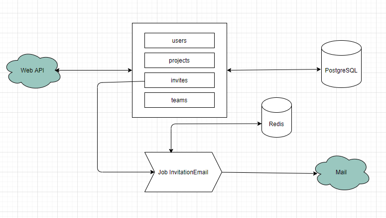

# Adonis API application

This is the boilerplate for creating an API server in AdonisJs, it comes pre-configured with.

1. Bodyparser
2. Authentication
3. CORS
4. Lucid ORM
5. Migrations and seeds

## Setup

Use the adonis command to install the blueprint

```bash
npm install
docker-compose up
adonis migration:run
adonis kue:listen
adonis server --dev
```

## Solution

This solution has the responsibility to exemplify API with node and using AdonisJs. 

The API is responsible for register users, projects and teams. It is also possible to invite members by email.


